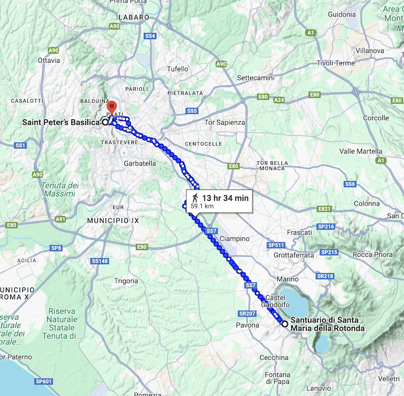

# Day 2 - June 20

[Official pdf](./Itinerary2.pdf)

[Day 2 Overview](https://maps.app.goo.gl/pdq7HkmKP93AYuRt7)

[Day 2 Overview](https://maps.app.goo.gl/pdq7HkmKP93AYuRt7)

## 08:30 - St Peter's Basilica 
[📚wiki](https://en.wikipedia.org/wiki/St._Peter%27s_Basilica) 
 /
[📍map](https://maps.app.goo.gl/Uc31VtB7nUhdc21t6)

	- 8:30 Meeting with the 2 guides in th hotel lobby for the visit of the St Peter's Basilica and Dome 
		- Guide N. 1: Leena Knuttila - Mob. Ph.: 0039/329/8598828
		- Guide N. 2: Gresi Pitino - Mob. Ph.: 0039/336/745929
	- 11:30 (Entrance to the Dome booked at 11:30)
## 12:00 🍕 Vatican Lunch
## 14:00 Gladiator Schol

## 🎶🎶 **Performance** in **Albano Laziale** - [📚wiki](https://en.wikipedia.org/wiki/Albano_Laziale) - [📍map](https://maps.app.goo.gl/1V6gsTzaVeHcBvrG8)
	-  @ (Square in front of the Sanctuary of Santa Maria della Rotonda) **Santuario di Santa Maria della Rotonda** - [📚wiki](https://it.wikipedia.org/wiki/Santuario_di_Santa_Maria_della_Rotonda) - [📍map](https://maps.app.goo.gl/xoybKUUWRmn8oDTM6)
## 21:00 🍕Vatican 
## Grand Hotel Olympic